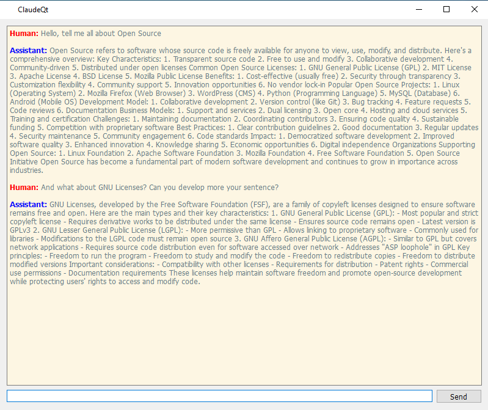

# ClaudeQt



ClaudeQt is a project designed to provide Claude AI features in your machine. This README provides an overview of the project, how to set it up, and how to contribute.

## Table of Contents

- [Dependencies](#dependencies)
- [Run](#run)
- [Contributing](#contributing)
- [License](#license)

## Dependencies

Before installing Pythonico, make sure you have the following dependencies installed:

- [Python 3.6 or above](https://www.python.org/downloads/)
- [PyQt6](https://pypi.org/project/PyQt6/)
- [Anthropic](https://pypi.org/project/anthropic/)

You can install these dependencies using `pip`, the Python package installer. Open a terminal or command prompt and run the following command:

```bash
pip install PyQt6 antrophic
```

Or you can install these dependencies using the package manager of your favorite Linux Distribution.

## Run

To run ClaudeQt, follow these steps:

1. Clone the repository:
    ```bash
    git clone https://github.com/yourusername/ClaudeQt.git
    ```
2. Navigate to the project directory:
    ```bash
    cd ClaudeQt
    ```

4. Run the application:
    ```bash
    python claudeqt.py
    ```

Make sure you have all the dependencies installed before running the application.

## Contributing

We welcome contributions to ClaudeQt! To contribute, follow these steps:

1. Fork the repository.
2. Create a new branch:
    ```bash
    git checkout -b feature-branch
    ```
3. Make your changes and commit them:
    ```bash
    git commit -m "Description of changes"
    ```
4. Push to the branch:
    ```bash
    git push origin feature-branch
    ```
5. Create a pull request.

## License

This library is free software; you can redistribute it and/or modify it under
the terms of the GNU General Public License, version 3. See [LICENSE](LICENSE) for details.
